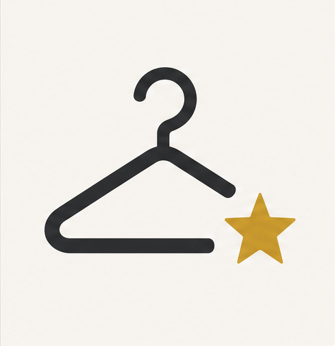

<!-- _class: title -->

<section>

  
  <h1>Smart Wardrobe Planner</h1>

Digitaler Kleiderschrank & Outfit-Bewertung

Doaa Al-Shoumi & Sameer Rana

  Grundlagen des World Wide Web · SS 2026 
  Betreuer: PD Dr. Alexander Hinneburg

</section>

---

<!-- SLIDE 2: Problem & Lösung -->

## Problem & Lösung

<h3>Problem</h3>
<ul class="card-list">
<li>Jeden Morgen die Frage: Was ziehe ich an?</li>
<li>Unklar, was gut zusammen aussieht</li>
<li>Kein Überblick über Kombinationen</li>
<li>Zeitaufwändiges manuelles Zusammenstellen</li>
</ul>

<h3>Idee</h3>
Ein digitaler Kleiderschrank, der Outfits bewertet und die Entscheidung erleichtert.

↓

App auf einen Blick

Alle Kleidungsstücke digital verwalten

★
Multi-Select für beliebige Kombinationen

↻
Radar-Chart bewertet jedes Outfit

⇄
Outfit-URLs zum Teilen speichern

---

<!-- SLIDE 3: Architektur -->

## App-Architektur

<h3>Daten aus JSON</h3>
<ul class="card-list">
<li>63 Kleidungsstücke aus JSON per HTTP</li>
<li>Wechsel zwischen Main- und Sommer-Schrank</li>
</ul>

<h3>Hash-basiertes Routing</h3>
<ul class="card-list">
<li>Home, Closet, About via #-Fragment</li>
<li>Vor-/Zurück-Navigation</li>
<li>Serverunabhängig</li>
</ul>

<h3>Filter & Tags</h3>
<ul class="card-list">
<li>Dynamische Tag-Filter-Leiste</li>
<li>Outfit-URLs zum Teilen (#/closet/id1+id2)</li>
</ul>

<h3>Elm-Architektur</h3>
<ul class="card-list">
<li>Model/Update/View strikt getrennt</li>
<li>Interaktives SVG-Radar aus elm/svg</li>
<li>Live-Neuberechnung bei jeder Auswahl</li>
</ul>

⚙
Elm 0.19.1
elm/svg
HTTP/JSON
GitLab Pages
Hash-Routing

---

<!-- SLIDE 4: Daten-Features (Filter, Wardrobes, JSON) -->

## Daten & Interaktion

<h3>JSON & Tag-Filter</h3>
<pre class="code-card">
{ "id":"black-dress", "name":"Black Midi Dress",
  "scoreStyle":85, "scoreComfort":40,
  "scoreFormal":90, "scoreDurable":70,
  "tags":["elegant","evening","black"] }

filtered = List.filter (\item ->
    List.any (\f ->
        List.member f item.tags)
        activeFilters) items
</pre>

<h3>Daten-Handling</h3>
<ul class="card-list">
<li><strong>Zwei JSON-Dateien</strong> <code>/items.json</code> (63) · <code>/summer.json</code> (21)</li>
<li><strong>HTTP-Ladung</strong> SwitchWardrobe lädt neue JSON + resetSelections</li>
<li><strong>Typsicherer Decoder</strong> Decode.map7 wandelt JSON in WardrobeData</li>
<li><strong>Dynamische Tags</strong> collectAllTags extrahiert Tags aus allen Items</li>
</ul>

---

<!-- SLIDE 5: Radar -->

## So funktioniert das Radar-Diagramm

Ein Radar-Diagramm zeigt auf einen Blick, wie gut ein Outfit in verschiedenen Kategorien abschneidet - je großer die Fläche, desto ausgewogener das Outfit.

<h3>Definition der Scores</h3>
<pre>
type alias Scores =
    { style : Int, comfort : Int
    , formal : Int, durable : Int }
</pre>

<h3>Berechnung (Maximum pro Kategorie)</h3>
<pre>
combineScores items =
    Scores (maxOf .style items)
           (maxOf .comfort items)
           (maxOf .formal items)
           (maxOf .durable items)

maxOf accessor list =
    List.maximum (List.map accessor list)
        |> Maybe.withDefault 0
</pre>

<h3>Umwandlung in SVG</h3>
<pre>
dataPolygon cx cy r axes =
    polygon [ points pts
            , fill "#6b4c3b"
            , fillOpacity "0.35"
            , stroke "#6b4c3b"
            , strokeWidth "2" ] []
</pre>

<h3>Vier Achsen, 90°-Winkel</h3>
<pre>
axes =
    [ ("Style",  deg 270, style)
    , ("Comfort", deg 0,   comfort)
    , ("Formal",  deg 90,  formal)
    , ("Durable", deg 180, durable) ]
</pre>

---

<!-- SLIDE 6: Ergebnis -->

## Ergebnis & Ausblick

<h3>Elm als Basis</h3>
<ul class="card-list">
<li>Typensicherheit verhindert Laufzeitfehler</li>
<li>Saubere Trennung von Zustand, Logik und Darstellung</li>
</ul>

<h3>Erreichte Ziele</h3>
<ul class="card-list">
<li>Voll funktionsfähiger Prototyp mit 3 Routen</li>
<li>63 Items in 7 Kategorien</li>
<li>Tag-Filter · Outfit-URLs zum Teilen</li>
<li>Kleiderschrank-Wechsel (Main/Summer)</li>
<li>Multi-Select Accessoires · SVG-Radar</li>
</ul>

<h3>Optimierung</h3>
<ul class="card-list">
<li>CSS-Styling aufwändiger</li>
<li>Früher mit Datenstruktur beginnen</li>
<li>Elm-Paketdokumentation gewöhnungsbedürftig</li>
</ul>

<h3>Ausblick</h3>
<ul class="card-list">
<li>Wetter-API für Vorschläge</li>
<li>Outfits als JSON exportieren</li>
<li>Filter nach Anlass (Uni, Party, Business)</li>
<li>Outfit-Bewertung speichern</li>
</ul>

